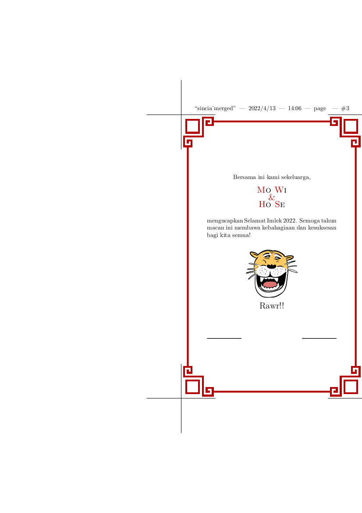

# Sincia 2022

To celebrate the year of the tiger. 
This time I use the [pgfornament](https://ctan.org/pkg/pgfornament?lang=de) 
package for the borders with TikZ. The tigers I found in google, should 
be available for non commercial use. 
The merged version is to be sent by print, the 1pg is to be sent digitally.
